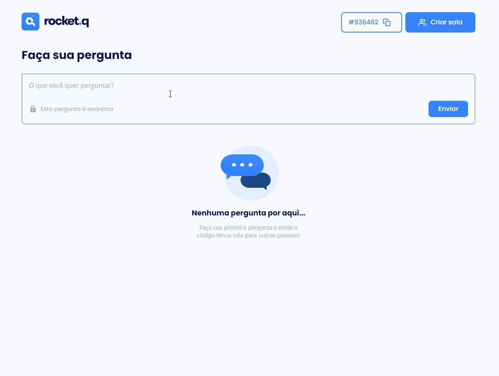

<h1 align="center">
    
</h1>

<div align="center">
    <h3> 🔷 Criando sua própria sala de maneira fácil. 🔷 </h3>
    <a href="https://rocketseat.com.br/" target="_blank">
      
    </a>
    <a href="https://github.com/PedroCantanhede" target="_blank">
      
    </a>
     
    
    
</div>

# Rocket.Q

O Rocket.Q é uma aplicação realizada na Next Level Week Together da Rocketseat com intuito de criar uma sala para internautas anônimos fazerem perguntas e, o criador da sala em posse de uma senha, gerenciar essas perguntas e marcar como lidas.

<p align="center">
  
</p>

# 🔨 Tecnologias

💻 HTML

💻 CSS

💻 JavaScript

💻 NodeJS

💻 EJS

💻 JSON

💻 Express

💻 SQLite

## :camera: Veja:

### Aplicação





### Código:


## :rocket: Instalação

```bash
# Clone o repositório
$ git clone https://github.com/PedroCantanhede/Rocket.Q.git

# Entre na pasta do projeto
$ cd rocketq

# Instale as dependências
$ npm install / yarn install

# Execute a aplicação
$ npm run dev / yarn dev

# Abra o projeto na porta: 3000 - acessando: http://localhost:3000
```
## 🔖 Layout

Você pode visualizar o layout do projeto através [desse link](https://www.figma.com/file/vp3iFfd1ohCbHyDX9jCiQi/Roquet.q). É necessário ter conta no [Figma](https://figma.com) para acessá-lo.

## :infinity: Ajuda da Rocketseat

A ajuda das aulas disponibilizadas durante a semana e a comunidade da Rocketseat foram essenciais para que eu chegasse no final do projeto. Deixo também meus agradecimentos a professora **Jakeliny Gracielly**.
[Venha e participe da próxima NLW!!!](https://discord.gg/YxU7fJT)
